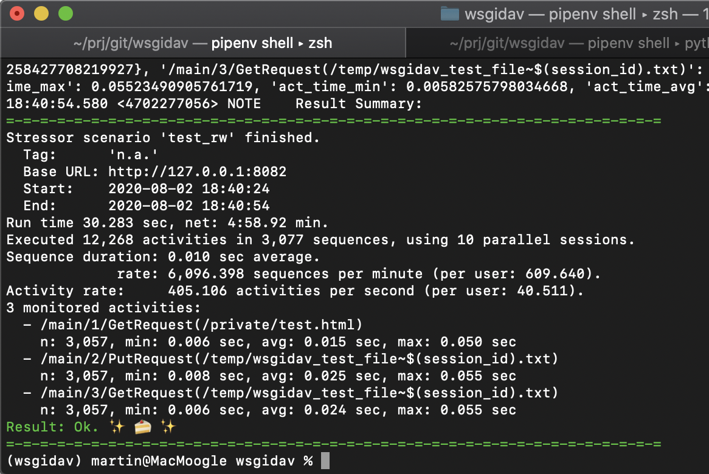
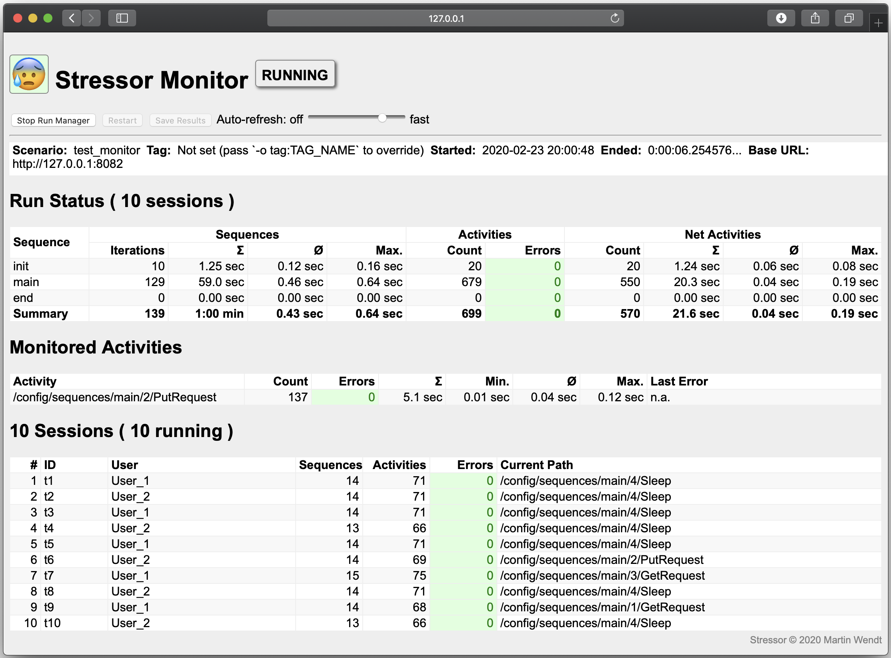

.. _main-index:

########
stressor
########

|travis_badge| |nbsp| |pypi_badge| |nbsp| |lic_badge| |nbsp| |rtd_badge| |nbsp|
|coverage_badge| |nbsp| |black_badge| |nbsp| |so_badge|

*Stress-test your web app.*

:Project:   https://github.com/mar10/stressor/
:Version:   |version|, Date: |today|

.. warning::
  Stressor has currently *beta* status.

.. toctree::
   :hidden:

   Overview<self>
   installation
   user_guide.md
   reference_guide
   development
   changes

Features
========

  * Run a sequence of *activities* in one or more parallel sessions.
  * Can be used for testing, benchmarking, load testing, or to generate
    test data.
  * The most common use case is to run a test script with HTTP commands
    against a web server, simulating a bunch of parallel user sessions.
  * A *monitor* GUI is available to view live progress of running sesssions.
  * Comes with prebuilt activities for HTTP-request and more, but can be
    extended by custom activity-plugins.
  * This is a command line tool that runs on Linux, macOS, and Windows...
  * ... and a library for use in custom Python projects.

Quickstart
==========

Releases are hosted on `PyPI <https://pypi.python.org/pypi/stressor>`_ and can
be installed using `pipenv <https://github.com/kennethreitz/pipenv>`_
(`Python 3.7+ <https://www.python.org/downloads/>`_ is required) ::

  $ pipenv shell
  (stressor) $ pipenv install stressor --upgrade
  (stressor) $ stressor --version -v
  (stressor) $ stressor --help
  (stressor) $ stressor init ./scenario_1
  (stressor) $ stressor run ./scenario_1/scenario.yaml

.. |travis_badge| image:: https://travis-ci.org/mar10/stressor.svg?branch=master
   :alt: Build Status
   :target: https://app.travis-ci.com/github/mar10/stressor

.. |pypi_badge| image:: https://img.shields.io/pypi/v/stressor.svg
   :alt: PyPI Version
   :target: https://pypi.python.org/pypi/stressor/

.. |lic_badge| image:: https://img.shields.io/pypi/l/stressor.svg
   :alt: License
   :target: https://github.com/mar10/stressor/blob/master/LICENSE.txt

.. |rtd_badge| image:: https://readthedocs.org/projects/stressor/badge/?version=latest
   :target: https://stressor.readthedocs.io/
   :alt: Documentation Status

.. |coverage_badge| image:: https://coveralls.io/repos/github/mar10/stressor/badge.svg?branch=master
   :target: https://coveralls.io/github/mar10/stressor?branch=master
   :alt: Coverage Status

.. |black_badge| image:: https://img.shields.io/badge/code%20style-black-000000.svg
   :target: https://github.com/ambv/black
   :alt: Code style: black

.. |so_badge| image:: https://img.shields.io/badge/StackOverflow-stressor-blue.svg
   :target: https://stackoverflow.com/questions/tagged/stressor
   :alt: StackOverflow: stressor

.. |logo| image:: stressor_48x48.png
   :height: 48px
   :width: 48px
   :alt: stressor

.. |stressor| raw:: html

   <a href="https://en.wikipedia.org/wiki/Stressor"><abbr title="A stressor is a chemical or biological agent, environmental condition, external stimulus or an event that causes stress to an organism.">stressor</abbr></a>
